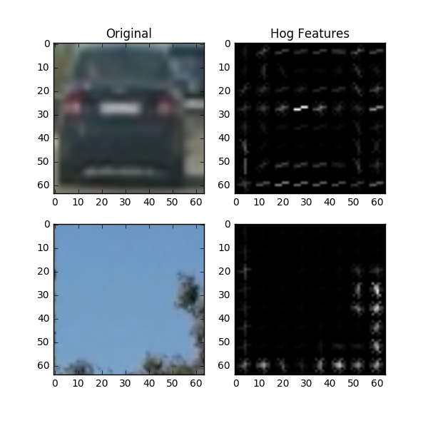
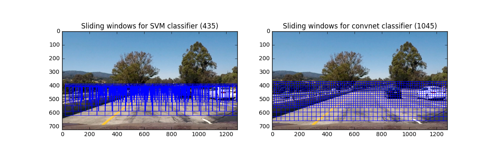
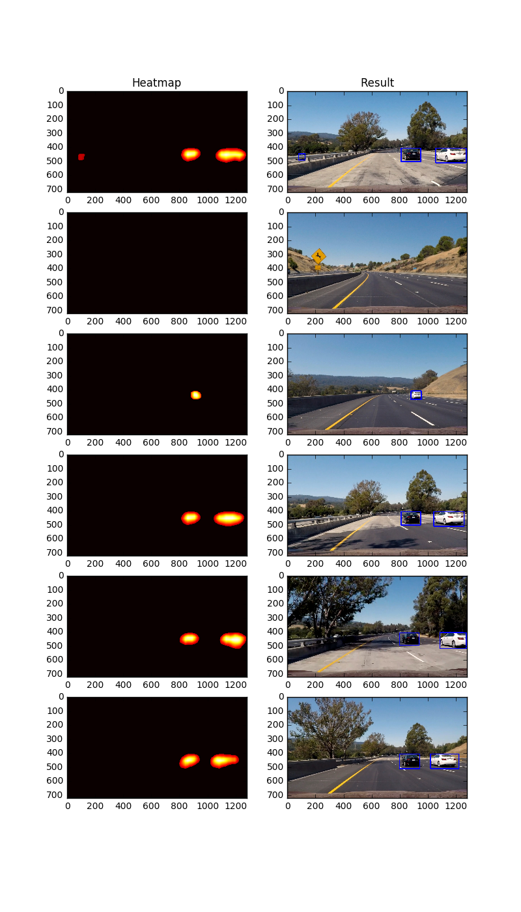

# CarND-Vehicle-Detection-P5
This is a writeup for my achievement for the vehicle detection project of CarND. My implementation of this project is presented in the [VehicleFinder](VehicleFinder) module and the [jupyter notebook](CarND-Vehicle-Detection-P5.ipynb) alternatively. There are 6 sections. 

1. Extract features;
2. Train a classifier;
3. Generate sliding windows;
4. Find cars on test images;
5. Find cars on videos;
6. Discussions.

---
## 1. Extract Features

Extract features for SVM or Naive-Bayes classifiers. The extracted features include **hog features**, **binned spatial pixels** and **channel histograms**. 

The default settings of the following `FeatureExtractor` are listed as below:

| features      | parameters  |
| --------------- |:-----------:|
| color_space    |   YCrCb   |
| orient       |   9      |
| pix_per_cell   |  (8, 8)    |
| cell_per_block  |  (2, 2)    |
| hog_channel    |    ALL    |
| spatial_bin_size| (32, 32)   |
| hist_bins     |   32     |

>**PS**: If the classifier is a nerual network, this step will not be necessary.

 Code implementation is presented in [feature.py](VehicleFinder/feature.py) and section 1 in the [notebook](CarND-Vehicle-Detection-P5.ipynb)
 
 I applied `FeatureExtractor` on some test images, visualization as below.
 
 
 
---
## 2. Train A Classifier

This section include two parts. The first part presents a feature classifier using machine learning techniques. The second part presents a simple convnet classifier.

Code implementation is presented in [classifiers.py](VehicleFinder/classifiers.py) and section 2 in the [notebook](CarND-Vehicle-Detection-P5.ipynb).

### 2.1 Feature classifier

Classify an image from its features using a SVM (as default) classifier. The `VehicleFeatureClassifier` can also use a `NaiveBayes` or any other machine learning classification methods in `scikit-learn`. `VehicleFeatureClassifier` also provide `predict`, `save_fit` and `load_fit` methods for easy use. 

One caveat of such a feature classifier is that extracting features is computational expensive, it could significantly slow down the whole process.

I trained a `LinearSVC` Classifier. The final valid accuray is 99.35%, which is pretty good result. However, the input image features must be strictly similar as the training features to distinct a car, if, say, an image only present part of a car or the car is propotionally small, the classifier won't give a correct result.

### 2.2 Convnet classifier

Classify an image directly using a simple convnet. My convnet consists of 3 `convolutional` layer and 2 `fully-connected` layer. Also, I embedded the normalization step into the network.

As compared to a SVM feature classifier, the convnet can also predict correctly even an image only present part of a car or the car is propotionally small.

The final valid accuray is 99.52%, which is better than SVM feature classifier.

---
## 3. Generate Sliding Windows

I implement two methods to generate sliding windows. One for the feature classifier, the other for the convnet.

- **windows for feature classifier**: Since such a classifier strictly limit the input image to be a car with proper fitted size, I generate the windows in a perspective way as the road.
- **windows for convnet classifier**: Three sliding windows in different yrange and size.

Code implementation is presented in [slide_windows.py](VehicleFinder/slide_windows.py) and section 3 in the [notebook](CarND-Vehicle-Detection-P5.ipynb).

I generated 435 windows for a SVM feature classifier, and 1045 for a convnet classifier. As shown below:

---
## 4. Find Cars (for Image)

I implemented a `VehicleFinder` for image. The `VehicleFinder4Image` use a heatmap to reduce false positive results. As for the convnet classifier, the heatmap threshold is 4. One thing to note is that, I smoothed the heatmap for a more smooth car bbox result.

Code implementation is presented in [vehicle_finder.py](VehicleFinder/vehicle_finder.py) and section 4 in the [notebook](CarND-Vehicle-Detection-P5.ipynb).

For the sake of speed, I use the convnet as well as the windows for convnet. The convnet is 16 times faster than the feature classifier.

Below is the result of test images, each with a heatmap. The result is just perfect, with accurate bounding boxes and no false positive detections.

I tried `VehicleFinder4Image` on `test_video.mp4`. The processing speed is 8 frames per second. The result is OK, but the bounding boxes seems not perfectly stable from frame to frame. I will handle this problem in the next section. See the result ([link](test_video_out_0.mp4)).

---
## 5. Find Cars (for Video)

The `VehicleFinder4Video` inherit from `VehicleFinder4Image` with just one difference: I averaged last `n_recs` (default as 5) heatmaps and then apply a threshold of 4. The result now become much stable.

Code implementation is presented in [vehicle_finder.py](VehicleFinder/vehicle_finder.py) and section 4 in the [notebook](CarND-Vehicle-Detection-P5.ipynb).

Applying `VehicleFinder4Video` on `test_video.mp4`, The result is no more words than perfect! See the result ([link](test_video_out.mp4)).

Now, for the `project_video.mp4`, The result is great! See [link](project_video_out.mp4).

---
## 6. Discussions

I implemented 2 kinds of classifier, one using machine learning techniques to classify image features, the other using a convnet to classify image directly. 

One caveat of the feature classifier is that extracting features of about more than 400 windows consumes too much time. Another problem is that such a classifier can not work well if an input image is a part of a vehicle or the car in the image is propotional too small. So I prefer a convnet classifier. And what's more, the convnet classifier is much faster using GPU. I generated more than 1000 windows for it. However, if I want an even better result, say more accurate bounding boxes and even detecting far away small vehicles, I need more small window proposals, which would significantly slow down detection speed.

My future plan is to design an end-to-end object detection network, such as YOLO, SSD. I am still working on it.
